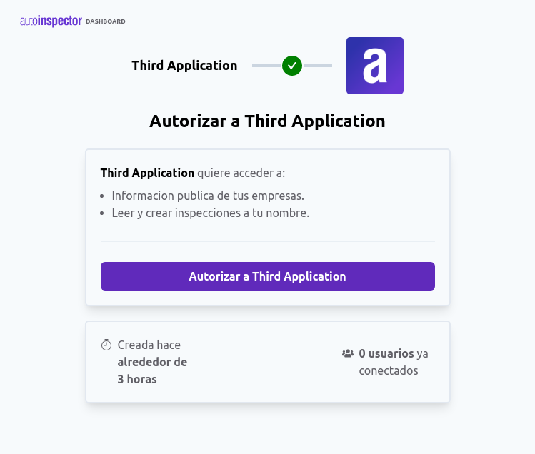
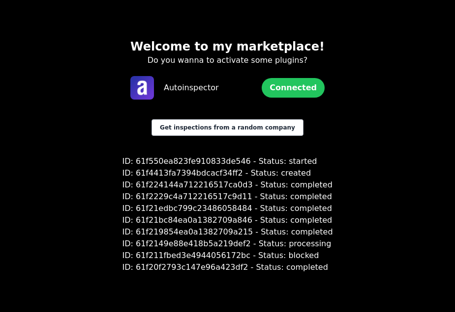

# Autoinspector Samples

Welcome to this sample. In this repository we tried to show how an Authorization Code Flow implementation can be done in a random platform.

## Stack Covered

- Node

# Get start

```bash
git clone https://github.com/autoinspector-global/oauth-sample
cd oauth-sample/node
cp .env.example .env
npm i
npm run start
open http://localhost:4000
```

# Overview





## Other languages

If you don't feel comfortable with languages outside of your knowledge, you always have a documentation that is agnostic to all of them. Feel free to check it out:

[Autoinspector API Reference](https://autoinspector.com.ar/docs/api/start)
